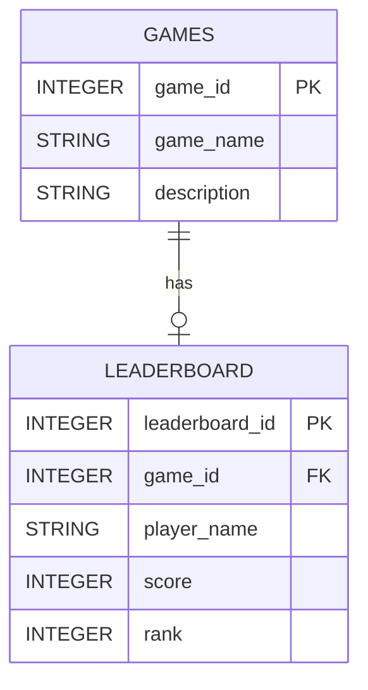
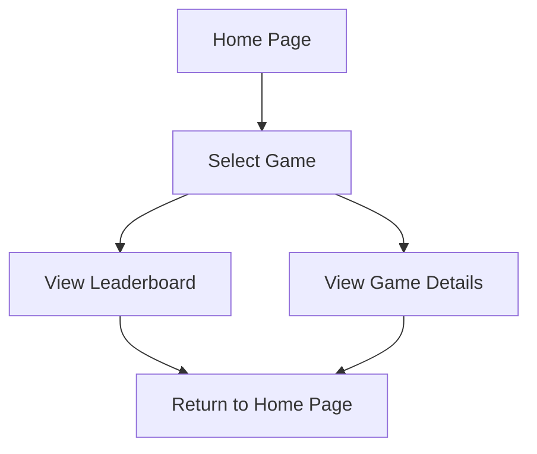

# App Description

> Leaderboard App is an application that will allow you to see the top scores and rankings of popular games and users from around the world! This application will use Pythons Flask Framework and the Jinja v2 templating engine and SQLite as database storage.

# Feature List

> Add/Remove Games
> Add/Remove Scores

# Required Features

> (Must-have for minimum functionality)

> Add/Remove Games
> Add/Remove Scores

# Should Have Features

> (Adds more value but not critical)

# Nice to Have Features

> Graphic Images / Site-wide Themes

# User Stories

> Who is using the app and what they can do (e.g., “As a quiz creator, I want to add questions so others can take my quiz”).

> As a player, I would like to add my scores
> As a player, I would like to add the game I like to play that is not listed
> As a player, I would like to edit my scores
> As a player, I would like to edit my scores

# Database Schema (ERD)

> Tables, their columns, and relationships.

# User Flow Diagram

> Pages of the app and how they connect. 

# List of Endpoints

> Routes (GET/POST) and expected input/output.

| Route                    | Description            |
| ------------------------ | ---------------------- |
| /                        | Main landing page      |
| /leaderboard/<game_name> | Stats for a given game |
